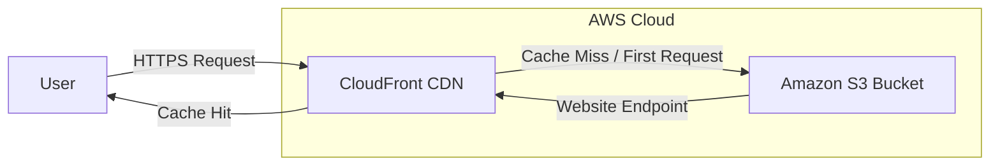

# 🚀 AWS S3 & CloudFront Static Website Deployment Project

This is an entry-level cloud architecture project designed to demonstrate how to host a static website using Amazon S3 and achieve global content delivery and acceleration with Amazon CloudFront.

---

## 💡 Project Goals & Highlights

* **Static Website Hosting:** Store HTML, CSS, JavaScript, and other static files in a highly available, durable, and scalable Amazon S3 bucket.
* **Content Delivery Network (CDN):** Leverage Amazon CloudFront as a CDN to cache website content at global edge locations, thereby accelerating content delivery, reducing access latency, and offloading traffic from the origin (S3).
* **Enhanced Security:** Ensure users access the website via encrypted connections by enforcing HTTPS redirection through CloudFront.
* **Serverless Architecture (Partial):** S3 and CloudFront are serverless services, eliminating the need to manage underlying servers, reducing operational complexity and cost.
* **Strict Free Tier Compliance:** The entire project is designed and implemented strictly within AWS Free Tier limits to ensure no additional costs are incurred during the learning process.

---

## 🛠️ AWS Services Used

* **Amazon S3:** Used for storing static website files (`index.html`, `error.html`, etc.), configured in static website hosting mode.
* **Amazon CloudFront:** Functions as a Content Delivery Network (CDN) to accelerate content delivery and provide low-latency global access.

---

## 📐 Architecture Diagram

Here's a high-level overview of the project's architecture:

Architecture Explanation:
---

A user's browser initiates an HTTPS request to the CloudFront domain.

CloudFront checks its global edge cache. If the content is cached (Cache Hit), it's returned directly to the user, providing extremely fast response times.

If the content is not cached or the cache has expired (Cache Miss), CloudFront forwards the request to the configured Amazon S3 static website endpoint (the origin).

S3 returns the requested static file to CloudFront.

CloudFront caches the file and delivers it to the user.

🚀 Deployment Steps (Step-by-Step)
---

### 1. Prepare Static Website Content 

Create the following files:

index.html: The main page of your website.

error.html: A custom 404 error page (optional, but recommended).

### 2. Create an S3 Bucket and Host the Static Website
Create S3 Bucket:

Log in to the AWS Management Console and navigate to the S3 service.

Click "Create bucket", naming it my-1st-aws-static-website-YOUR_UNIQUE_IDENTIFIER (e.g., my-1st-aws-static-website-kokol152).

Choose a region close to you (e.g., Tokyo ap-northeast-1).

Uncheck "Block all public access" and confirm, as we will configure it for public static website hosting.

Click "Create bucket".

Upload Website Files:

Navigate into your newly created bucket, click "Upload", and upload index.html and error.html.

Configure Static Website Hosting:

In your bucket's "Properties" tab, scroll down to "Static website hosting" and click "Edit".

Select "Enable", and choose "Host a static website".

Set "Index document" to index.html and "Error document" to error.html.

Save changes and note down the displayed Bucket website endpoint (e.g., http://my-1st-aws-static-website-kokol152.s3-website-ap-northeast-1.amazonaws.com).

Configure Bucket Policy for Public Read Access:

In your bucket's "Permissions" tab, edit the "Bucket policy".

Paste the following JSON, replacing YOUR_BUCKET_NAME with your actual bucket name, to allow public s3:GetObject access.

JSON

    {
        "Version": "2012-10-17",
        "Statement": [
            {
                "Sid": "PublicReadGetObject",
                "Effect": "Allow",
                "Principal": "*",
                "Action": [
                    "s3:GetObject"
                ],
                "Resource": [
                    "arn:aws:s3:::YOUR_BUCKET_NAME/*"
                ]
            }
        ]
    }

Save the policy.

### 3. Accelerate Content Delivery with Amazon CloudFront
Create CloudFront Distribution:

Navigate to the CloudFront service.

Click "Create Distribution".

Origin domain: Select your S3 static website hosting endpoint (e.g., my-1st-aws-static-website-kokol152.s3-website-ap-northeast-1.amazonaws.com).

S3 bucket access: (In the new console, if you select the S3 website endpoint, this option typically won't appear, as it assumes the S3 bucket is publicly readable. For a more secure approach with S3 REST API, you'd configure an Origin Access Control (OAC). For this project, using the public S3 website endpoint simplifies setup.)

Viewer protocol policy: Recommended to select "Redirect HTTP to HTTPS".

Cache policy: Keep the default CachingOptimized.

WAF (Web Application Firewall): Choose "Do not enable security protections" (to avoid extra costs within Free Tier).

Price class: Keep the default "Use all edge locations (best performance)" (this will not incur additional costs within Free Tier and provides global acceleration).

Default root object: Set to index.html.

Click "Create distribution".

Wait for Deployment: CloudFront distribution deployment takes 5-15 minutes. Wait until the status changes to "Enabled".

Test CloudFront Website: Copy the "Domain name" of your CloudFront distribution (e.g., d123exampleabcd.cloudfront.net) and paste it into your browser.

### 4. (Optional) Configure CloudFront Custom Error Pages
To ensure CloudFront also uses your error.html page:

Go to your CloudFront distribution details, click the "Custom error pages" tab.

Click "Create custom error response".

Set HTTP error code to 404: Not Found.

Under "Customize error response", select "Yes", and set "Response page path" to /error.html.

You can set "HTTP Response code" to 200 OK (for a user-friendly experience) or 404 Not Found (for semantic correctness).

### 5. (Optional) Enable CloudFront Standard Access Logs
If you wish to track user access records:

Go to your CloudFront distribution details, under the "General" tab, find the "Settings" section.

Edit "Standard logging" settings and select an S3 bucket to store the logs.

Note: Log storage and transfer may incur minimal costs, but usually fall within the Free Tier limits.

🧹 Resource Cleanup (To Avoid Unnecessary Costs)
---

After completing your learning, it's crucial to clean up the AWS resources you created to avoid incurring unnecessary charges:

Delete CloudFront Distribution:

In the CloudFront console, select your distribution, then click "Disable".

Once the status changes to "Disabled", select the distribution again and click "Delete".

Empty and Delete S3 Bucket:

In the S3 console, navigate into your static website bucket.

Select all objects, click "Delete", and confirm by typing "permanently delete".

Go back to the bucket list, select your bucket, click "Delete", and confirm by typing the bucket name.

🙋‍♂️ Interview Analysis Points
---
   
When discussing this project in an interview, you can elaborate on the following points:

Technology Stack Choice: Why choose S3 and CloudFront for static website hosting? (Cost-effectiveness, scalability, high availability, serverless nature).

Architecture Design: Explain the data flow (User -> CloudFront -> S3) and the role of each component.

Performance Optimization: How does CloudFront enhance website speed and user experience? (Edge caching, global presence).

Security Considerations: How is access controlled through HTTPS and S3 Bucket Policy? The role of OAI/OAC (if understood and used)? When is WAF applicable, and what are its cost implications?

Cost Management: How was the project kept within Free Tier limits? Demonstrate understanding and practical application of AWS Free Tier.

Troubleshooting: How would you troubleshoot if the website becomes inaccessible? (Checking S3 permissions, CloudFront distribution status, logs, etc.).

Future Scalability: How would you extend this architecture for a dynamic website or one requiring user authentication? (e.g., by introducing Lambda@Edge, API Gateway, DynamoDB, etc.).

👤 Author Information
---
kokoL152

License
---
This project is created for educational and demonstration purposes and comes with no specific license.
